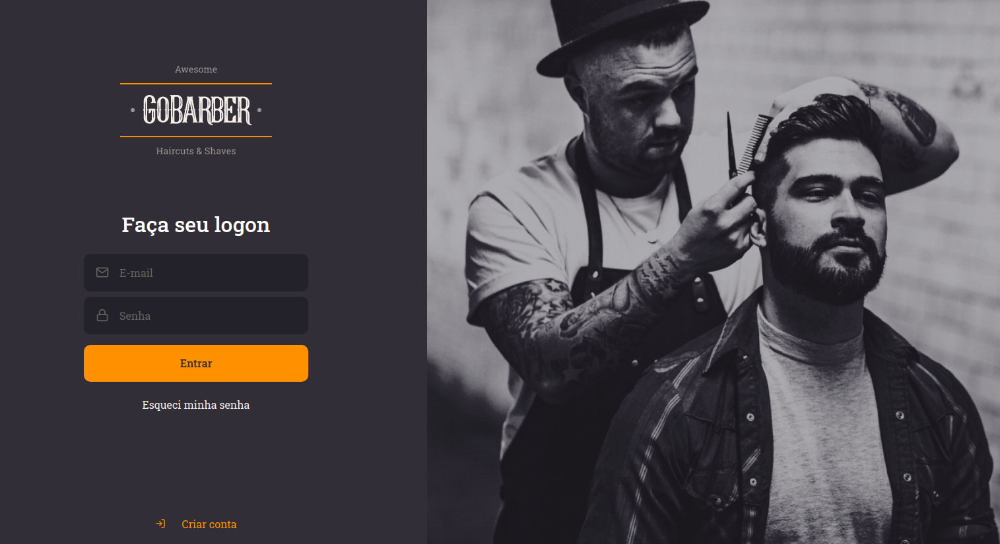
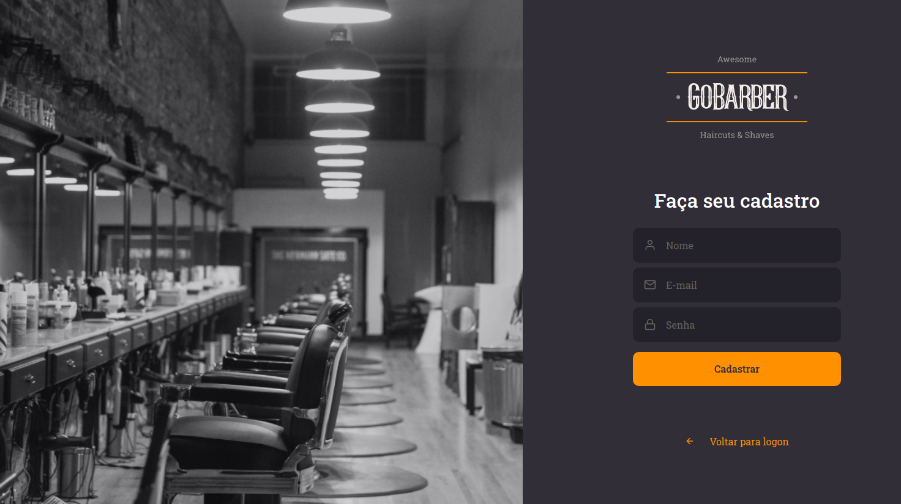

<h3 align="center">
  Front-end da aplicação GoBarber
</h3>

  

  

  

  

## :rocket: Sobre a aplicação

Nesta aplicação utilizou-se o React para desenvolvido da interface da aplicação GoBarber.

<h4>SignIn</4>
 

<h4>SignUp</4>
 

